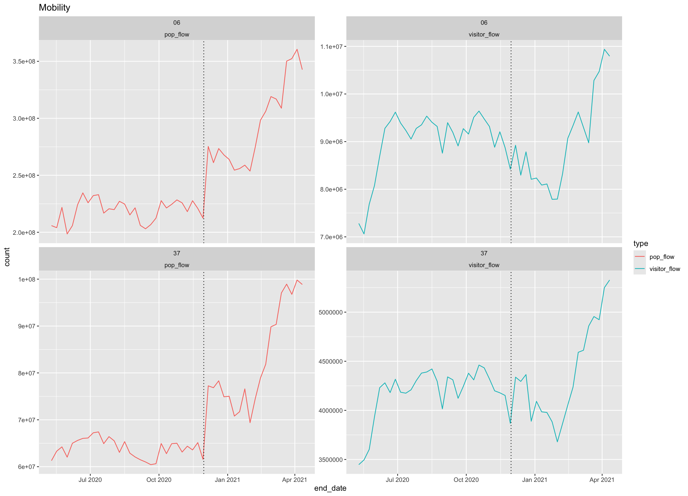

## [Mobility](./)

Please note that the SafeGraph time series shows a large and
persistent increase in mobility, particularly for population flows,
occurring on November 30, 2020, which is not reflected in comparator
datasets such as [Cuebiq](https://covid19.gleamproject.org/mobility). 

The coordination team reached out to the authors of the mobility data 
to inquire about the origin of the spike and received the following response:

> "The pop_flow is extrapolated
from the observed visitor_flow and active mobile device in that
region. And the track of active mobile devices has large uncertainty.
Therefore, it could be possible that there is larger pop_flow value
due to either the increase mobility flow ("visitor_flow")  or the
decrease of active mobie device in a region. So, depending on which
type of model you are doing, you can ingest either variable
(the directly observed "visitor_flow" or the extrapolated population
level estimated flow." 

We recommend that teams consider this
uncertainty when interpreting the large mobility increase. 

